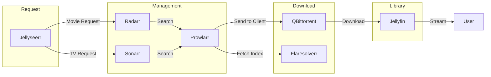
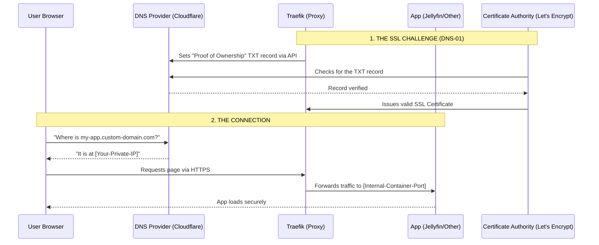

# compose-home-nas 💿

> A media server stack for home NAS, featuring the complete ARR suite with Traefik reverse proxy, VPN integration, and automated SSL certificates.

### 🎯 Key Features

- **🔒 Secure Remote Access**: Traefik reverse proxy with automatic SSL certificates via Cloudflare DNS-01 challenge
- **🛡️ VPN Integration**: Gluetun VPN gateway for accessing restricted resources
- **🎬 Complete ARR Stack**: Sonarr, Radarr, Prowlarr, Jellyseerr for automated media management
- **📺 Media Streaming**: Jellyfin with hardware transcoding support
- **🔄 Automated Workflows**: From request to playback with zero manual intervention
- **📊 Resource Optimized**: Carefully tuned resource limits for efficient home server operation

## 🏗️ Setup

### File Structure

```txt
${MEDIA_SHARE}
├── media/
   ├── downloads/        # Downloads
   ├── movies/           # Organized movie library
   ├── tv/               # Organized TV shows
   └── music/            # Organized music library

${CONFIG_ROOT}
├── traefik/
│   └── certificates/     # SSL certificates
├── gluetun/              # VPN configuration
├── jellyfin/
│   ├── config/           # Jellyfin settings
│   └── cache/            # Transcode cache
├── jellyseerr/           # Request portal config
├── sonarr/               # TV show management
├── radarr/               # Movie management
├── prowlarr/             # Indexer management
├── qbittorrent/          # Torrent client config
└── flaresolverr/         # Cloudflare bypass
```

### Environment

```bash
# User Configuration
USER_ID=1000
GROUP_ID=1000
UMASK=002
TIMEZONE=America/New_York

# Domain Configuration
DOMAIN=your-domain.com

# Path Configuration
CONFIG_ROOT=/path/to/config
MEDIA_SHARE=/path/to/media
SECRETS=/path/to/secrets

# VPN Configuration (Private Internet Access)
PIA_REGION=us-east
```

### Secrets

```bash
# Cloudflare API token (needs DNS:Edit permission)
echo "your-cloudflare-token" > ${SECRETS}/cf_dns_api_token

# Cloudflare account email
echo "your-email@example.com" > ${SECRETS}/cf_api_email

# Traefik basic auth (generate with: htpasswd -nb user password)
echo "user:$$2y$$10$$..." > ${SECRETS}/traefik_basic_auth

# PIA VPN credentials
echo "pia-username" > ${SECRETS}/pia_user
echo "pia-password" > ${SECRETS}/pia_pass
```


## 🔄 Media Flow




## 🔄 SSL Certificate Flow (DNS-01 Challenge)


