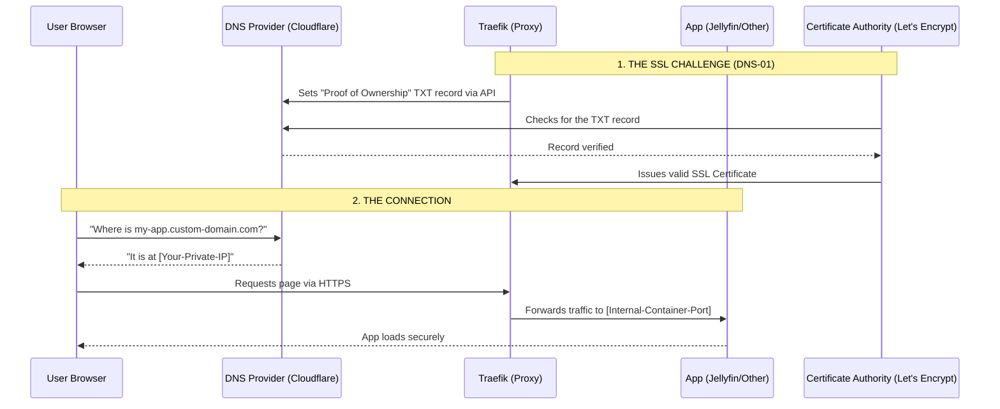

# compose-home-nas 💿

> Docker compose to use with home UGEEN NAS Setup.

## File Structure

```txt
.MEDIA_SHARE
└──media
  ├──downloads
  ├──tv
  └──movies

.CONFIG_ROOT
├──jellyfin
│  └──cache
├──transmission
├──sonarr
└──jakett

```
## Dns resolve


