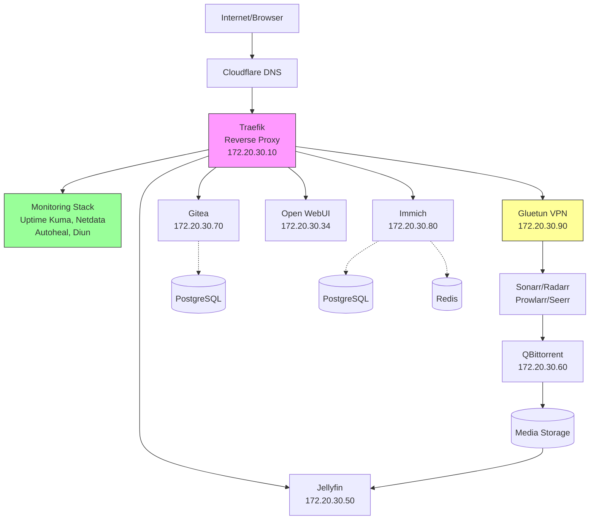

# compose-home-nas 💿

Complete Docker Compose stack for UGreen NAS featuring media automation, photo management, self-hosted services, and monitoring.

## 📦 What's Included

| Category | Services | Access |
|----------|----------|--------|
| **Gateway** | Traefik (reverse proxy + SSL) | `traefik.${DOMAIN}` |
| **Monitoring** | Uptime Kuma, Netdata, Autoheal, Diun | `uptime.${DOMAIN}`, `netdata.${DOMAIN}` |
| **Notifications** | Gotify | `gotify.${DOMAIN}` |
| **Git** | Gitea + PostgreSQL | `gitea.${DOMAIN}` |
| **Photos** | Immich + PostgreSQL + Redis + ML | `immich.${DOMAIN}` |
| **Media** | Jellyfin | `jellyfin.${DOMAIN}` |
| **Automation** | Sonarr, Radarr, Prowlarr, Seerr, Jackett | Various subdomains |
| **Downloads** | QBittorrent + Gluetun VPN | `qbit.${DOMAIN}` |
| **AI** | Ollama + Open WebUI | `oi.${DOMAIN}` |
| **Notes** | Obsidian Sync (CouchDB) | `obsidian-sync.${DOMAIN}` |
| **Cameras** | Frigate | `frigate.${DOMAIN}` |

**Total:** 25+ containers | **Monitoring:** ~1GB RAM | **SSL:** Auto via Let's Encrypt

---

## 🏗️ Architecture

```mermaid
graph TB
    Internet[Internet/Browser] --> CF[Cloudflare DNS]
    CF --> T[Traefik<br/>Reverse Proxy<br/>172.20.30.10]

    T --> Mon[Monitoring Stack<br/>Uptime Kuma, Netdata<br/>Autoheal, Diun]
    T --> Git[Gitea<br/>172.20.30.70]
    T --> Photos[Immich<br/>172.20.30.80]
    T --> Media[Jellyfin<br/>172.20.30.50]
    T --> AI[Open WebUI<br/>172.20.30.34]
    T --> VPN[Gluetun VPN<br/>172.20.30.90]

    VPN --> ARR[Sonarr/Radarr<br/>Prowlarr/Seerr]

    Git -.-> PG1[(PostgreSQL)]
    Photos -.-> PG2[(PostgreSQL)]
    Photos -.-> Redis[(Redis)]

    ARR --> DL[QBittorrent<br/>172.20.30.60]
    DL --> Storage[(Media Storage)]
    Storage --> Media

    style T fill:#f9f,stroke:#333
    style Mon fill:#9f9,stroke:#333
    style VPN fill:#ff9,stroke:#333
```

**Network:** All services on `restricted_wan` (172.20.30.0/24) with fixed IPs
**SSL:** Traefik handles automatic Let's Encrypt certificates via Cloudflare DNS-01
**Isolation:** Databases on separate internal networks

---

## 🔍 Monitoring

**Included services:**
- **Autoheal** - Auto-restart unhealthy containers
- **Uptime Kuma** - Uptime monitoring dashboard
- **Netdata** - Real-time metrics
- **Diun** - Update notifications
- **Watchtower** - Optional auto-updates

**Get notified when:**
- Containers crash
- Services go down
- Updates available
